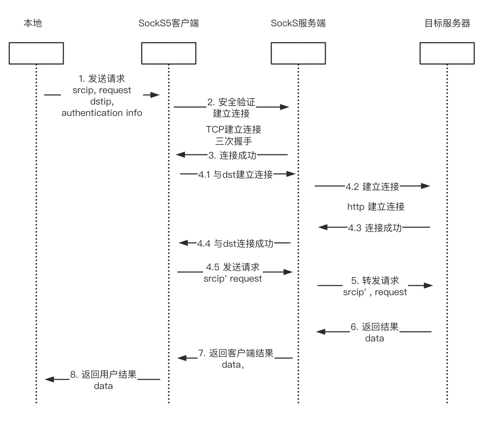

# Socks5 Server
## 什么是Socks5？

Socks5是一种用来实现内网与外部网络连接的协议，它在客户端与服务器间作为数据的转发桥梁，将外部网络的数据返还给客户端。

这是一个在会话层工作的协议（session layer）

* Socks协议有什么用，为什么需要它？

在一些管理严格的公司中，大部分网络交互都是内网间的，随意访问外部网络对公司是十分的危险，但又有外部网络访问的需求，因此我们就需要提供一个socks服务器作为**内外网连接的桥梁**，转发通信的数据，socks协议起用到一种保护内网网络的作用；外部网络户无法直接访问内部网络，需要通过socks与内部网络建立连接（所谓vpn？），只有得到socks服务器安全验证的连接才能访问到内部网络；

socks是打通内部外部网络访问的中介，隐藏内部网络信息保护网络安全，socks5接受到客户端的数据报文后，会将源ip和源端口号修改为自身的，达到一种保护客户端信息的功能
**通过SockS5中介，使得令两个无法直接相连的网络组织互通**
## Socks工作流程简述

1. 当客户端需要与外部网络建立连接时，向Socks服务器发送TCP请求，建立与SockS服务器的网络连接（建立这个链接需要密码或一系列身份验证）
2. SockS服务器接受到请求后与外部目标服务器通过tcp三次握手建立网络连接，成功后返回信息给客户端
3. 客户端开始传送数据，数据会先到达Socks服务器，Socks协议会无条件转发数据并不会对数据进行修改

## 概要设计

实现一个SockS5客户端和服务器，客户端接受用户请求，在安全验证后建立与SockS服务端的安全连接；

建立连接后，用户发送请求给SockS客户端，客户端转发请求给服务器，服务器建立与目标主机的联系并请求对应的内容，接收到数据后通过SockS安全连接将数据返回给客户端，客户端根据相应信息返回给用户

## 详细设计

### 启动客户端进程

- 监听端口 1080（socks5的默认端口）
- 每收到一个请求，启动一个进程来处理它请求

> 参考文档：
>
> [C++实现SockS](https://www.lyytaw.com/%E7%BD%91%E7%BB%9C/%E7%94%A8c%E8%AF%AD%E8%A8%80%E5%86%99%E4%B8%80%E4%B8%AAsocks5%E4%BB%A3%E7%90%86%E6%9C%8D%E5%8A%A1%E5%99%A8/#4-%E5%A4%84%E7%90%86%E8%AF%B7%E6%B1%82)
>
> [用go实现socks](https://segmentfault.com/a/1190000038247560) 
>
> [RFC 1928]( https://datatracker.ietf.org/doc/html/rfc1928)
